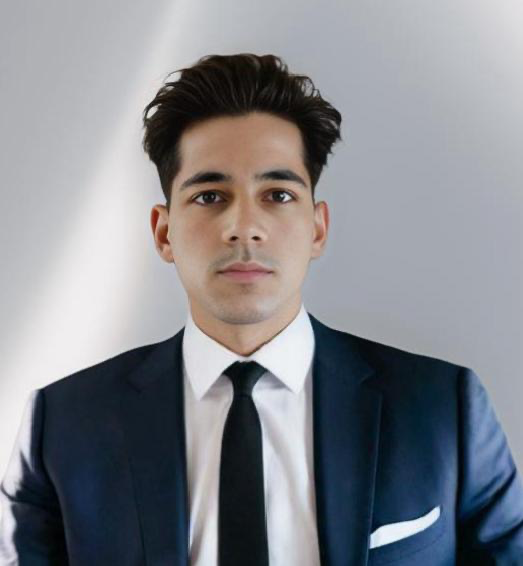

::: {.columns .profile}

::: {.column width="32%"}
{fig-alt="Professional headshot of Abhay Partap Thakur" width=220 .headshot}

### Contact
- **Location:** Vancouver, BC, Canada  
- **Email:** [ab4072g@gmail.com](mailto:ab4072g@gmail.com)  
- **LinkedIn:** [linkedin.com/in/abhay-thakur-9a36b7345](https://www.linkedin.com/in/abhay-thakur-9a36b7345/)  

### Key Skills
- Strategic leadership & decision-making  
- Corporate social responsibility (CSR) and ethics  
- Financial and market analysis  
- Business development & branding  
- Data-driven problem solving  
- Cross-cultural communication  
:::

::: {.column width="68%"}

## About
I am an MBA candidate at **University Canada West** with a focus on **Strategic Management, Business Analytics, and Corporate Ethics**. I am interested in helping organizations turn data and structured analysis into clear strategic choices and measurable business outcomes.

My leadership experience includes serving as CEO of both a family restaurant business and a sustainable footwear company. In these roles I have led teams, redesigned operations, strengthened customer experience, and anchored decisions in ethical and socially responsible practices. I enjoy working at the intersection of strategy, execution, and innovation.

## Education
**Master of Business Administration (MBA)** — University Canada West, Vancouver, BC  
2024 – Present · Focus: Strategic Management, Business Analytics, Corporate Ethics  

**Bachelor of Commerce (B.Com)** — Punjab University, India  
Graduated with distinction · Focus: Accounting, Marketing, Entrepreneurship  

## Professional Experience
**Chief Executive Officer — Zency Kicks** | 2022 – Present  
- Founded and manage a sustainable shoe company focused on style, comfort, and ethical sourcing.  
- Lead business development, CSR initiatives, and brand positioning in competitive markets.  
- Direct cross-functional teams to achieve **30% year-over-year growth** through innovation and community engagement.  

**Chief Executive Officer — Family Restaurant Business** | 2019 – Present  
- Oversee daily operations, employee management, and customer service strategy.  
- Implement digital tools to improve supply chain visibility and marketing effectiveness.  
- Increase profitability by redesigning the customer experience and improving operational efficiency.  

## Projects & Highlights
- **MBA Case Study — Trendy Tees Time Series Forecasting**  
  Designed a sales forecasting approach using historical data to support inventory planning, reduce stockouts, and improve profitability.  

- **Ethics and CSR Report — Zency Kicks**  
  Developed a sustainable business strategy emphasizing ethical sourcing, social responsibility, and support for Indigenous communities.  

:::

:::
---

_Note: The initial outline for this page was drafted with the assistance of ChatGPT. All final content has been reviewed, verified, and edited in my own words._
